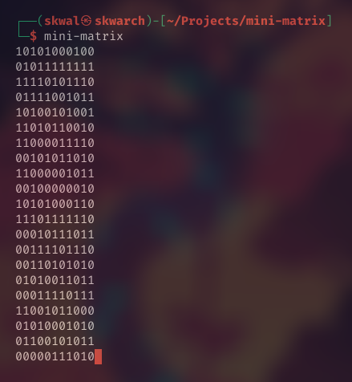
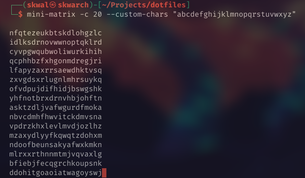
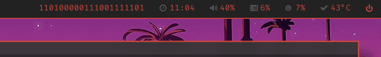

# Mini matrix



👨‍💻 Output random 0 and 1 or custom characters with a matrix-like effect

# Installation

## Arch 🐧

```bash
yay -S mini-matrix
```

## Debian based distros 🐧

clone github repo

```bash
git clone https://github.com/SkwalExe/mini-matrix
```

run make

```bash
cd mini-matrix
make
```

# Windows 🪟

Since this is a bash script, you normally can't run it directly on windows.

You will have to install [Git Bash](https://git-scm.com/download/win) and follow the instructions for [Debian based distros](#debian-based-distros-).

# Usage 

```
Usage: mini-matrix [OPTION]

Autor : SkwalExe [Léopold Ibghy Koprivnik]
Github : https://github.com/SkwalExe

Displays a matrix of random characters

Options:
  -h, --help    Show this help message and exit
  -v, --version Show version and exit
  -s, --speed   Set the delay between each line [default: 0.5]
  -l, --loop    Loop the output [default: false]
  -c, --chars   Set the number of characters to output [default: 10]
  -a, --custom-chars   Set the custom characters to use [default: "01"]
```

## Example

`mini-matrix -c 20 --custom-chars "abcdefghijklmnopqrstuvwxyz"`



## Example with polybar  

```ini
[module/matrix]
type = custom/script
exec = mini-matrix -c 20 -s 0.07
tail = true
```



# Used by 

- ### [dotfiles](https://github.com/SkwalExe/dotfiles)

# Docker 🐳

## Run the latest version

```bash
docker run --rm -it ghcr.io/skwalexe/mini-matrix:main
```

## Test your changes 🚧

### Build 🛠️

```bash
# 📂 mini-matrix/
docker build -t mini-matrix .
```

### Run 🏃

```
docker run --rm -it mini-matrix

bash-5.1# mini-matrix [OPTIONS]
```

# final

If you have any probleme, don't hesitate to open an issue

# contributing

Pull requests are welcome. For major changes, please open an issue first to discuss what you would like to change.

<a href="https://github.com/SkwalExe#ukraine"></a>